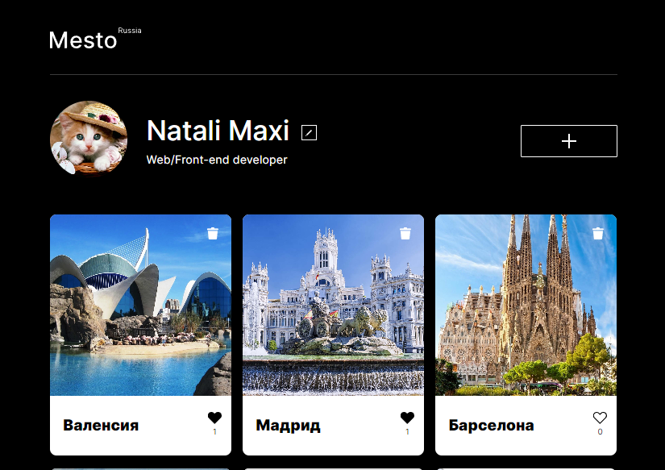

[](https://natalymaxi.github.io/mesto/)
# Проект: Место (версия на React)

## O проекте
Проект Mesto интерактивное приложение, позволяющее добавлять, удалять свои картинки, а так же лайкать понравившиеся картинки других пользователей. Выполнен в рамках серии проектных работ в Яндекс.Практикуме по профессии «Веб-разработчик»
### Функциональность и стек технологий:
- JSX:
  - Семантические теги
- CSS3:
  - Flexbox;
  - Grid Layout;
  - Media Queries;
  - Positioning of blocks and elements;
  - Adaptive UI;
  - Pseudo-classes
- JavaScript (ES 6):
  - ООП, Fetch API;
  - Просмотр увеличенной карточки в модальном окне;
  - Редактирование информации пользователя;
  - Обновление аватара;
  - Добавление новой карточки;
  - Добавление и снятие лайка (счетчик лайков);
  - Формы редактирования профиля и добавления карточки находятся в модульных окнах;
  - Удаление карточки с модальным окном подтверждения действия;
  - Асинхронный код: промисы и HTTP-запросы;
  - API сервера Яндекс.Практикум;
  - Webpack;
- React:
  - Использование Create React App;
  - Хуки useState, useEffect, useRef, useContext;
  - Поднятие стейта;
  - Глобальный стейт через React Context;
  - Управляемые компоненты в элементах формы;
- Методология БЭМ;
- Фйловая структура Nested БЭМ;
- Подключение шрифтов @font-face;

### Как установить и запустить проект:

```
git clone https://github.com/NatalyMaxi/mesto-react
cd mesto-react
npm install
npm start
```

### Деплой проекта на Github Pages
```
npm run deploy
```

[Ссылка на проект Github Pages](https://natalymaxi.github.io/mesto-react/)   
[Макет в Figma](https://www.figma.com/file/2cn9N9jSkmxD84oJik7xL7/JavaScript.-Sprint-4?node-id=0%3A1&t=9azKBTC6lzNE0zrS-0)  